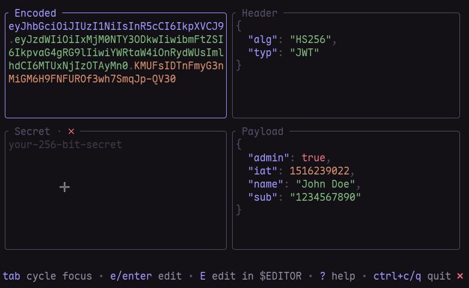

# Jwt-tui

A terminal UI for inspecting, editing, and signing JSON Web Tokens (JWTs).



Built with [Bubbletea](https://charm.land/bubbletea) and [Lipgloss](https://charm.land/lipgloss).

## Features

- **Decode**: paste a JWT and instantly see the pretty-printed header and payload
- **Encode**: edit the header or payload JSON and get a freshly signed token
- **Verify**: real-time signature validation against a secret (HS256 / HS384 / HS512 / none)
- **4-panel layout**: header, payload, JWT, and secret all visible and editable at once
- **Themeable**: Colors and styles can be customized using [ilovetui](https://github.com/anotherhadi/ilovetui), which applies theme changes across all compatible TUI applications at once.
- **Rebindable keys**: customize keybindings in the config file

## Installation

<details>
<summary>Go install</summary>

```sh
go install github.com/anotherhadi/jwt-tui/cmd/jwt-tui@latest
```

Requires Go 1.22+. The binary will be placed in `$GOPATH/bin` (or `~/go/bin`).

</details>

<details>
<summary>Nix (temporary run, no install)</summary>

```sh
nix run github:anotherhadi/jwt-tui
```

</details>

<details>
<summary>NixOS (flake)</summary>

Add jwt-tui to your flake inputs:

```nix
inputs.jwt-tui.url = "github:anotherhadi/jwt-tui";
```

Then add the package to your system or home-manager packages:

```nix
environment.systemPackages = [ inputs.jwt-tui.packages.${pkgs.system}.default ];
```

</details>

## Usage

```sh
jwt-tui                                      # launch with default config
jwt-tui -t <token>                           # pre-fill the JWT token
jwt-tui -t <token> -s mysecret              # pre-fill token and secret key
jwt-tui -t $(cat token.txt) -s mysecret     # read token from a file
```

### Keybindings

<!-- exec: echo '```' && go run ./cmd/jwt-tui -h && echo '```' -->
```
Usage: jwt-tui [flags]

      --add-default-config   copy the default config file to the config path and exit
  -c, --config string        path to config file
  -s, --secret string        pre-fill the secret key
  -t, --token string         pre-fill the encoded JWT token
  -v, --version              print version
```
<!-- endexec -->

## Configuration

The config file lives at `~/.config/jwt-tui/config.yaml` by default. Run `--add-default-config` to generate it.

Exemple:

```yaml
keybindings:
  quit: "ctrl+c"
  cycle_focus: "tab"
```
